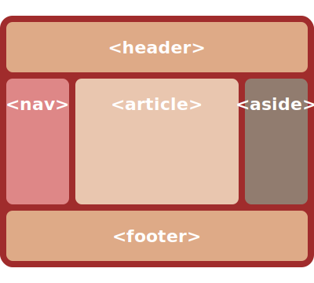
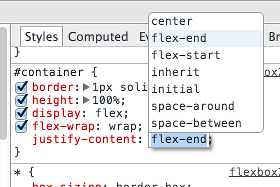

# Exercise: Getting Started with FlexBox - Part 1

Place the following HTML in a file:

```.html
<div id="container">
    <div class="box box1">1</div>
    <div class="box box2">2</div>
    <div class="box box3">3</div>
    <div class="box box4">4</div>
    <div class="box box5">5</div>
    <div class="box box6">6</div>
    <div class="box box7">7</div>
</div>
```

> Here's a [Flexbox Cheatsheet](https://yoksel.github.io/flex-cheatsheet/) to help you out.

## Exercise: Getting Started with FlexBox - Part 2

Add these styles:

```.css
#container {
    border: 1px solid darkred;
    height: 100%;
}
.box {
    font: 18pt sans-serif;
    text-align: center;
}
.box1 { background-color: red; }
.box2 { background-color: orange; }
.box3 { background-color: yellow; }
.box4 { background-color: forestgreen; }
.box5 { background-color: dodgerblue; }
.box6 { background-color: purple; }
.box7 { background-color: violet; }
```

## Exercise: Getting Started with FlexBox - Part 3

1. Now add `display: flex;` to the _container_ div. What happens?
   (Take a copy of your HTML file here - call it `justify.html`.
   We'll use it later.)
1. To have the items displayed proportionately, add `flex: 1;` to each _item_ (use the `box` class). What happens now?
   Resize your browser and notice how items grow and shrink automatically.

### Item Sizing

The `flex` property says “give each box 1 proportion of the whole space”.
Let's give Box 4 _two_ proportions:

1. Create a new rule for class `box4`, and give it a property `flex: 2;`.
   See how this affects the items in the browser.

---

## Recap

1.  We laid the container out using _flex layout_:

        #container {
            display: flex;
        }

1.  We gave each item a proportion of the whole:

        .box {
            flex: 1;
        }

1.  We gave Box 4 two proportions:

        .box4 {
            flex: 2;
        }

## Exercise - Changing Orientation

1. Experiment with changing the container's orientation (`flex-direction`) to each of the four values:
   1. `row`
   1. `column`
   1. `row-reverse`
   1. `column-reverse`

---

## Line Wrapping

FlexBox will ‘wrap’ lines (think word wrap):

```.css
.container {
    flex-wrap: wrap;
}
```

- FlexBox won't make individual items smaller than their `min-width` or `min-height`

---

## Exercise - Line Wrapping

1. Set the container to line wrap. Does this change anything, even if you resize the window?
1. Set each item (use class `box`) to `min-width: 200px;`. What changes?
1. Try setting the container to `flex-wrap: wrap-reverse`. What happens now?

---

## Display Order

You can give each item an `order` in which to appear in the display:

```.css
.box5 {
    order: 2;
}
```

- The default `order` is 1
- Items are displayed lowest-order first

---

## Exercise - Display Order

1. Set box 5 to a higher order than 1. Where does it appear?
1. Make boxes 3 and 2 appear later still.
1. Inspect the elements in the developer tools.
   At what point does the browser apply the ordering?
1. Has it changed the DOM?

---

## Exercise - Display Order - Part 2

Suppose you wanted to achieve a classic three-column layout,
but the source order is as in the HTML below.
How would you use FlexBox to correct this?
Implement your answer.



```.html
<header>...</header>
<div id='main'>
   <article>...</article>
   <nav>...</nav>
   <aside>...</aside>
</div>
<footer>...</footer>
```

> There's a partial answer to this [here](https://codepen.io/pete/pen/rxRgvX)
> (with a different HTML source).

---

## Example - Justify Content

1. Open your `justify.html` file from earlier in a browser.
1. Inspect the container div.
1. Add a new CSS rule, enter `justify-content` and hit tab.
   A menu should appear (below).
1. Use the cursor keys to move up and down through the values to explore the effects they have.



---

## Exercise

1. Modify your `justify.html` file:
   - Make the container's height 200px.
   - Make the heights of any three items different (say 30px, 70px and 100px).
1. Open your file in a browser.
1. Again use developer tools, adding to the container a property `align-items` and hit tab.
1. Cycle through the properties using the arrow keys and observe the effect.
